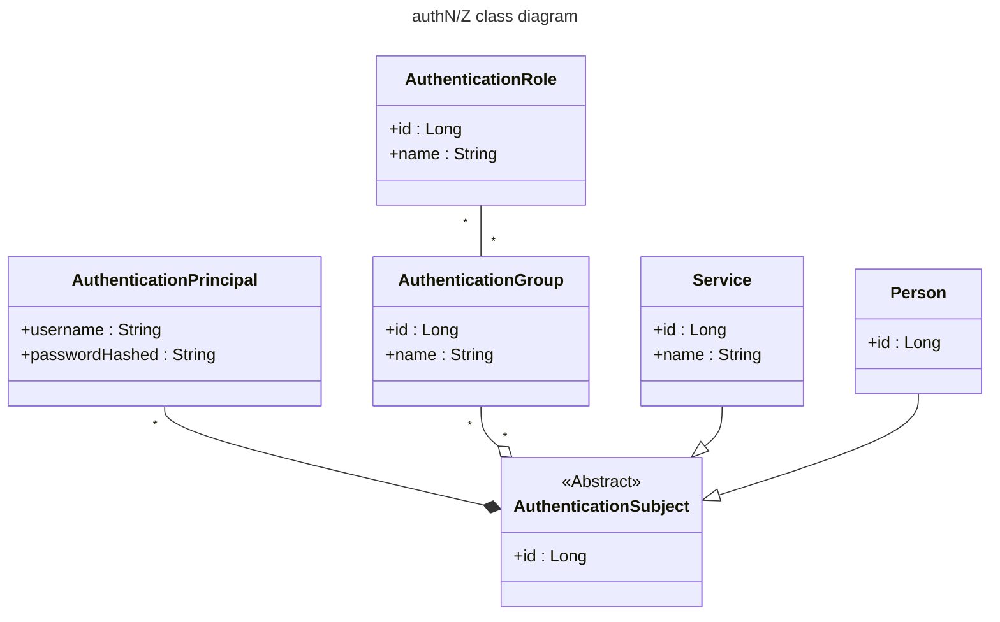
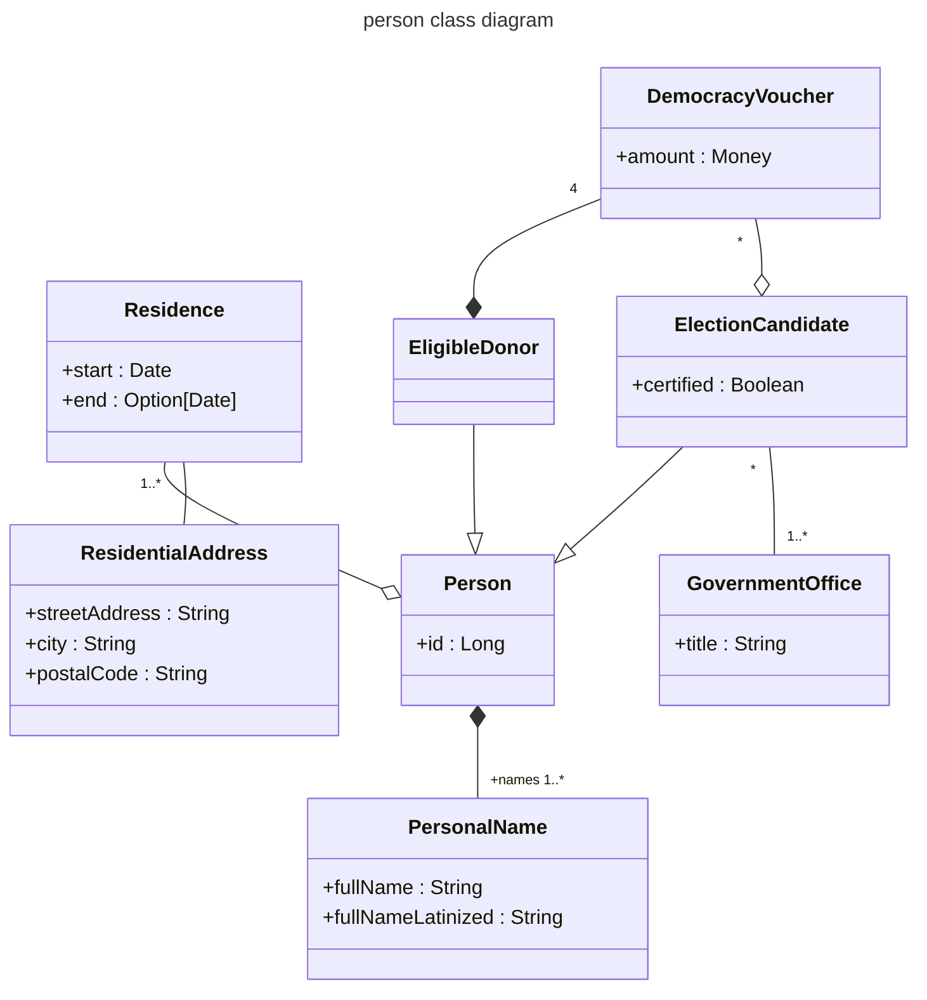

# Democracy vouchers database

This subproject contains [a manually-maintained database description](democracy-vouchers.changelog.xml)
(in the form of a [Liquibase changelog][Liquibase-changelog])
from which the build generates:
- a database schema
- a library of Scala [Slick][Slick] classes for accessing the database

## database schema

## generates database-specific code

Most examples of [the Slick code generation tool][Slick-codegen] use an in-memory instance of the H2 database server
as a target for generating the database schema that Slick reads back via JDBC.
The shortcoming to that is that Slick _could_ generate different code
depending on which database software it reads from.
So the code generated from H2 may not work correctly with MySQL, for example.

This subproject is different in that one configures into the build,
for which database software type(s)—PostgreSQL, MySQL, Oracle, etc.—one wants to generate code.
For each such type it creates an instance of the database server and generates the corresponding code,
one such library for each database type.

[Liquibase-changelog]: https://docs.liquibase.com/concepts/changelogs/home.html
[Slick]: https://scala-slick.org/
[Slick-codegen]: https://scala-slick.org/doc/3.5.0/code-generation.html
